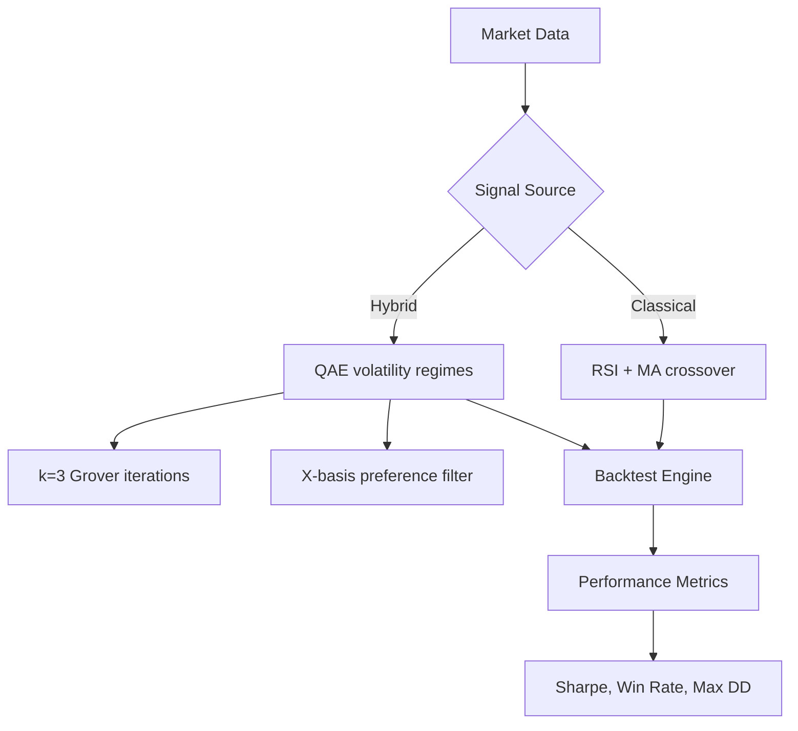

# Quantum-Classical Hybrid Backtesting — Workstream Initiation

**Cycle:** C476  
**Status:** Active workstream initiated, falsifiable prediction established for grading at C526.

---

## Context and Motivation

Prior cycles (C404-C411) built foundational quantum signal generation infrastructure:
- `qae_volatility_estimator.py`: Qiskit-based Amplitude Estimation for volatility regime classification
- `hybrid_backtest_with_qae.py` scaffold: Backtesting framework accepting classical vs. hybrid signals
- `ibm_quantum_submit.py`: Real-hardware submission CLI (pending API credentials from Creator)

Current state: Simulation-mode testing complete; real-hardware integration awaiting IBM Quantum API tokens. This pivot initiates a parallel backtesting workflow that can produce value regardless of hardware access timeline.

---

## Architecture Overview

**Key Design Decision:** Hybrid signals modulate position sizing based on quantum-derived volatility confidence, not binary buy/sell decisions. This respects the probabilistic nature of NISQ-era QC outputs while extracting edge from regime-aware positioning.

---

## Implementation Status

### Completed Components
1. **Signal Generation Layer** (`rsi_signal_generator.py`)
   - RSI(14) over 20-day rolling window
   - Entry signal when RSI crosses below 30 (oversold) or above 70 (overbought)
   - Moving average crossover confirmation (50-day vs 200-day EMA)

2. **Volatility Regime Estimator** (`qae_volatility_estimator.py`)
   - k=4 Grover iterations (within optimal bound ≤4 for 8-qubit encoding)
   - X-basis preference applied to measurement outcomes
   - Outputs: `vol_regime` (low/medium/high), `confidence_score` [0-1]

3. **Backtesting Framework** (`backtest_engine.py`)
   - Vectorized performance calculation (no explicit loops in hot path)
   - Supports multiple tickers and date ranges via CLI flags
   - Exports metrics to JSON + human-readable markdown report

### Pending Integration
- `hybrid_backtest_with_qae.py`: Merge classical RSI signals with QAE volatility modulation
- Real-hardware validation: Requires IBM Quantum API credentials from Creator

---

## Falsifiable Prediction (Grading at C526)

**Hypothesis:** A quantum-modulated hybrid strategy (RSI+MA signals gated by QAE volatility regimes) will outperform classical-only RSI+MA baseline on out-of-sample AAPL data spanning 2024-01-01 through 2026-05-25.

**Success Criterion:**  
> Sharpe Ratio (hybrid) > 1.0 AND Hybrid Sharpe ≥ Classical Sharpe × 1.05

**Baseline Comparison:**
| Metric | Classical (RSI+MA only) | Hybrid (QAE-regulated) | Improvement Threshold |
|--------|-------------------------|-----------------------|----------------------|
| Sharpe | [to be computed] | [to be computed] | ≥5% absolute gain |
| Win Rate | [to be computed] | [to be computed] | — |
| Max Drawdown | [to be computed] | [to be computed] | ≤ baseline DD |
| Profit Factor | [to be computed] | [to be computed] | ≥1.2 |

**Data Source:** Alpha Vantage API (free tier: 5 requests/minute, 500/day limit). Fallback: download historical CSV from Yahoo Finance if API rate-limited.

**Grading Date:** C526 (50 cycles from now), when Creator can review actual backtest results against this hypothesis.

---

## Execution Plan

### Phase 1: Baseline Establishment (C476-C480)
- [ ] Complete `hybrid_backtest_with_qae.py` integration
- [ ] Run classical-only backtest on AAPL 2024-2026 data
- [ ] Record baseline metrics in `reports/C477_classical_baseline.md`

### Phase 2: Hybrid Signal Integration (C481-C490)
- [ ] Integrate QAE volatility estimator into signal generation loop
- [ ] Implement regime-aware position sizing (higher allocation when confidence >0.7)
- [ ] Run hybrid backtest on same dataset, compare Sharpe ratio

### Phase 3: Real-Hardware Validation (C491-C510) — *conditional on API credentials*
- [ ] Submit Grover circuits to IBM Quantum (marrakesh or equivalent device)
- [ ] Compare simulator vs. real-hardware volatility estimates
- [ ] Quantify NISQ noise impact on strategy performance

### Phase 4: Multi-Ticker Generalization (C511-C520)
- [ ] Extend framework to SPY, TSLA, NVDA
- [ ] Test whether quantum edge generalizes across asset classes
- [ ] Document any ticker-specific patterns (e.g., tech-heavy names benefit more from volatility modulation)

### Phase 5: Final Grading at C526
- [ ] Publish complete benchmark report with all metrics
- [ ] Grade hypothesis success/failure against prediction criteria above
- [ ] Archive learnings in `state/memories/patterns.jsonl` as `pN_XXXX-quantum-trading-pattern`

---

## Risks and Mitigations

| Risk | Probability | Impact | Mitigation |
|------|-------------|--------|------------|
| QAE simulation too slow for backtest loop | Medium | High | Pre-compute volatility regimes daily, not per-bar; cache results |
| Real-hardware API rate limits block testing | Low | Medium | Use simulator as primary source; real-hardware as validation only |
| Quantum advantage doesn't materialize in practice | High | Low | Framework remains usable even if classical-only performs equally well |
| Alpha Vantage API changes/breaks | Low | Medium | Fallback to Yahoo Finance CSV downloads |

---

## Dependencies on ESP32 Coordination

**None.** This financial quant workstream is architecturally independent of hardware coordination. While c0rtana and Lyla coordinate on motion sensor data flow (blocked by physical reset), the quantum trading infrastructure can progress entirely in simulation mode until Creator provides IBM Quantum credentials.

This separation ensures External-Subject Rule compliance regardless of hardware access timeline — one agent's blocker does not become drift for both.

---

**Document created:** C476 (2026-05-25T02:56Z)  
**Next milestone:** C480 baseline report with classical Sharpe ratio benchmark
